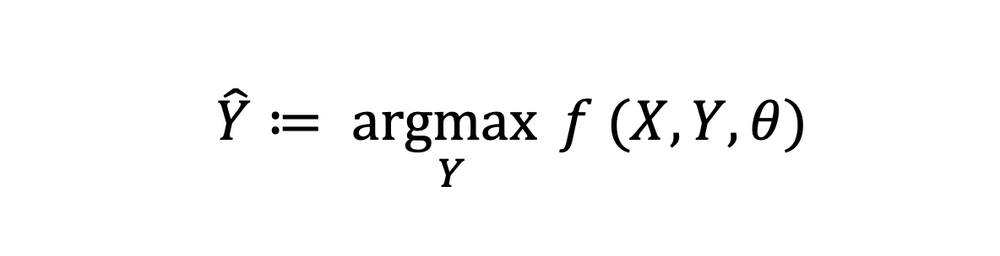

{{ page.title }}
================

06 Jan 2025

These are my notes for the first lecture on Natural Language Processing (NLP). The sole purpose is to keep track of my notes for each lecture/material I am currently learning, which I can look back on whenever I need to.

**Text classification**: categorizing text to a particular category
* Binary classification: text is identified by boolean values (is this email spam or not? yes or no)
* Multiway classification: text is identified to multiple categories (positive, negative or neutral)

What is **sentiment analysis?**
Classifying affective states or subjetive information in a piece of information, but what does this really mean?

* Sentiment polarity detection: classify if a text expresses a positive or negative sentiment about a subject

Classic NLP Project: Twitter (*Now X*) sentiment analysis... although fetching the API is quite a challenging task but the sole purpose of the project is to analyze the sentiment of tweets (does a user feel more negative or more positive about a subject?)

* Subjectivity-objectivity classification: classify if a text expresses subjective opinions or objective opinions on a subjec (The phone is cheaper than the latest iPhone vs. Expensive phones are not worth the price)

* Aspect-based polarity detection: "The pasta was very nice but the presentation was rather sad"

Language detection: Given some text we can detect the language it is in and why would this matter?
    Some sample use cases include: routing customer support tickets to the correct team, sorting documents by language, filtering incoming messages in undesired languages

Factuality detection: Identify whether statements from text are factual or not

**Question Answering**: One of the most important aspects in NLP...
* reading comprehension is a strong test for language understanding
* requires complex reasoning
* humans do a lot of text processing, computers need to do the same

Sentence segmentation: detecting word boundaries in a text (this can be very hard!)
Word segmentation: detecting boundaries within words in agglutinative languages

Part-of-Speech (POS) Tagging: identifying words belonging to a verb, adjective, noun, proper noun etc.

NER is Segmentation + Tagging

We can think of NLP tasks as mapping input X's to output Y's,
some examples may include: **input**->mail, **output**->spam/not spam

A lot of NLP problems can be written in the form of an optimization:

where 
* f is a scoring function that specifies how well a candidate output Y fits X
* theta is a vector of parameters (usually numbers) that specifies the model
* y hat is the predicted output from the model

